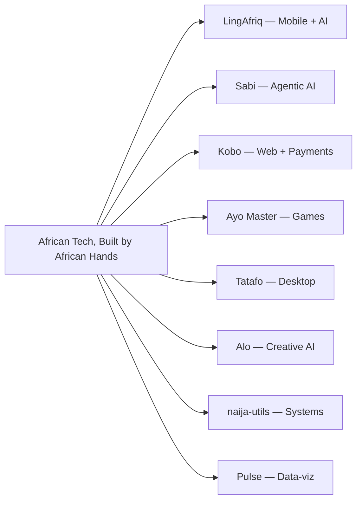

# Portfolio Project Roadmap — Temitope Olaitan

> Deep-research deliverable: the software to build to establish legitimacy as a
> senior developer with genuine, demonstrated range across Web, Mobile, Desktop,
> AI, Games and Systems — anchored to one coherent thesis so the breadth reads as
> intentional, not scattered.

---

## 1. The strategy (why these projects)

Three findings from 2026 market research drive every choice below.

1. **Agentic AI is the single clearest senior differentiator.** Hiring has moved
   from "prompting" to *agentic systems engineering*: orchestration, tool-calling,
   evaluation harnesses, observability, guardrails, cost control. Python appears
   in ~97% of AI-agent postings. The hard part is reliability, treated like
   distributed-systems engineering — not prompt tricks.
2. **Depth beats a long list.** Recruiters want 3–5 *polished* projects, each with
   a live demo, public source, and documentation written like a spec. One
   cohesive, production-grade system that shows architectural depth outperforms ten
   tutorial clones.
3. **The market is explicitly polyglot.** A base layer (a language + a cloud), an
   ops layer (containers + CI/CD + monitoring), and one depth specialty (here:
   AI/agents) is the shape of a senior generalist in 2026.

**The through-line:** your existing, authentic thesis — *African technology must be
built by African hands*. Every project ladders into it AND hits a high-demand 2026
domain. That coherence is what reads as senior.

---

## 2. The portfolio at a glance

| # | Project | Domain | 2026 capability proven | Status | Effort |
|---|---------|--------|------------------------|--------|--------|
| 1 | LingAfriq | Mobile + AI | Cross-platform mobile + adaptive AI | In progress (real) | Anchor |
| 2 | Sabi | Agentic AI / Backend | Multi-agent orchestration, evals, observability | Roadmap | High |
| 3 | Kobo | Full-stack Web + Payments | Auth, idempotent webhooks, money safety | Roadmap | Med-High |
| 4 | Ayo Master | Games + AI | Game loop, state machine, minimax/alpha-beta | Demo live | Medium |
| 4b | **SPORTVERSE** | Games + Platform | Shared XP economy, quiz engine, tactical sim PWA | **Alpha live** | High |
| 5 | Tatafo | Desktop + AI | BM25 search, watcher, local-first | Implemented | Medium |
| 6 | Alo | Creative AI / Media | LLM + TTS + AI video pipeline | Roadmap | Medium |
| 7 | naija-utils | Systems / OSS | Library design, tests, CI, semver | Roadmap | Low-Med |
| 8 | Pulse | Web / Data-viz | Streaming data, WebSockets, custom shaders | Implemented | Medium |
| 9 | Akowe | Web + AI | Meeting minutes, transcription, export templates | Implemented | Medium |

**Recommended build order (after the website):** Sabi → Kobo → Ayo Master →
Tatafo, with naija-utils run in parallel as a fast credibility win. Sabi alone,
done with evals + observability, moves you into senior agentic-AI territory.

---

## 3. Project briefs

Each brief follows the same shape so they can become README specs and case studies.

### 1. LingAfriq — Mobile + AI (anchor, already real)
- **Problem:** Global language apps ignore African languages; hundreds of millions
  of speakers/heritage learners have no serious mobile-first way to study Yoruba,
  Igbo, Hausa with real polish.
- **Stack:** Flutter, Dart, REST APIs, LLM integration, ElevenLabs TTS.
- **Senior signal:** Full product ownership — UX, learning-science curriculum,
  shipping client, AI layer that must be reliable for real users.
- **Definition of done:** Published app, adaptive lesson engine, AI tutor with
  guardrails + cost caps, content data-driven so new languages ship without
  client releases.

### 2. Sabi — Agentic AI / Backend (flagship)
- **Problem:** Millions of African micro-businesses run on WhatsApp + a notebook.
  They don't need a dashboard; they need something that *does the work*.
- **Architecture:** WhatsApp gateway → planner → worker (typed tools) → critic →
  commit, with vector memory (RAG), guardrails, retries/backoff, hard spend caps,
  an eval harness in CI, and distributed tracing.
- **Stack:** Python, LangGraph (or equivalent), typed tool schemas, vector DB,
  observability (tracing/metrics), WhatsApp Business API.
- **Senior signal:** Agent reliability as distributed-systems engineering:
  idempotent tool calls, graceful degradation, audit trails, eval gates.
- **Definition of done:** ≥3 real tools (inventory, invoicing, CRM), an eval suite
  measuring task success + tool-call accuracy, traces for every trajectory,
  documented cost/latency budgets.

### 3. Kobo — Full-stack Web + Payments
- **Problem:** African freelancers/SMEs need simple invoicing + payment collection
  (Paystack/Flutterwave) with reminders and receipts.
- **Stack:** Next.js (React), PostgreSQL, auth, Paystack/Flutterwave webhooks,
  PDF generation, transactional email.
- **Senior signal:** Handling money safely — auth at boundaries, **idempotent
  webhook processing**, reconciliation, audit logging, least-privilege.
- **Definition of done:** Auth, invoice CRUD, hosted payment + verified webhook,
  PDF + email delivery, idempotency + replay protection, test coverage on the
  money path, live deploy.

### 4. Ayo Master — Games + AI (interactive demo is already live on the site)
- **Problem/idea:** Ayoayo (Yoruba Mancala) is centuries old and deeply strategic
  — perfect to show cultural rootedness + CS fundamentals in one playable artifact.
- **Stack:** TypeScript, Canvas/DOM, minimax + alpha-beta, Web Audio.
- **Senior signal:** A working adversarial-search AI with a clean separation of a
  pure, testable rules engine from rendering.
- **Definition of done:** Faithful rules as a pure state machine (unit-tested),
  minimax + alpha-beta with depth-by-difficulty, accessible + reduced-motion-safe
  UI. *(A playable version already ships on `/demos`.)*

### 5. Tatafo — Desktop + AI
- **Problem:** A private, offline-first way to search and chat over your own files.
- **Stack:** Tauri (Rust) — small fast binary — embeddings + local vector search,
  optional local LLM.
- **Senior signal:** Desktop range + Rust exposure + privacy-first AI (offline RAG).
- **Definition of done:** Index local folders, semantic search, grounded answers
  with citations, fully offline, signed builds for Win/macOS/Linux.

### 6. Alo — Creative AI / Media
- **Problem:** Turn African folktales into narrated, captioned short videos.
- **Stack:** LLM (script/structure) + ElevenLabs TTS + an AI video pipeline.
- **Senior signal:** A real generative *pipeline* with versioned prompts and
  validated outputs — creative range beyond single API calls.
- **Definition of done:** Text → structured script → narration → captioned video,
  reproducible pipeline, a small published gallery.

### 7. naija-utils — Systems / Open Source
- **Problem:** Repeated NG-specific dev needs: phone/NIN/BVN validation, Naira
  formatting, state/LGA data.
- **Stack:** TypeScript (and/or Python) package, unit tests, CI, semver, docs.
- **Senior signal:** Engineering rigor and maintainership — tests, CI, clean public
  API, changelog, published package.
- **Definition of done:** Published to npm/PyPI, 90%+ coverage on core, CI green on
  PR, documented API, ≥1 real consumer (e.g. Kobo).

### 8. Pulse — Web / Data-viz
- **Problem:** A live, beautiful dashboard of African tech/dev ecosystem metrics.
- **Stack:** Streaming data, WebSockets, custom WebGL shaders, performance budget.
- **Senior signal:** Visual craft + performance engineering (60fps, instancing,
  graceful fallbacks).
- **Definition of done:** Real-time updating views, custom shader visual, Lighthouse
  90+, accessible data tables behind the visuals.

---

## 4. Cross-cutting standards (apply to every project)

- **Docs as spec:** README with problem, architecture diagram, "why this stack",
  and run instructions. This is what makes a project read as senior.
- **Live demo + public source** for each.
- **Tests** on non-trivial logic; **CI** running lint + typecheck + tests on PR.
- **Security by default:** validate at boundaries, assume hostile input, no secrets
  in code/logs, least privilege, parameterized queries.
- **Observability** where it applies (especially Sabi/Kobo): structured logs,
  metrics, traces.

---

## 5. How the website supports this roadmap

The consolidated site (this repo) is itself proof, not just a list:

- **`/work`** renders all eight briefs as case studies (content collection in
  `src/content/projects/`), filterable by domain, each marked live / in-progress /
  roadmap so ambition reads as a plan, never overclaiming.
- **`/demos`** ships three *working* in-browser artifacts — a minimax board-game AI
  (Ayo Master), an agentic-AI trace (Sabi), and a mobile micro-lesson (LingAfriq).
- As each roadmap project is built, flip its `status` to `live`, add `links`, and it
  upgrades in place — the site grows with the work.
